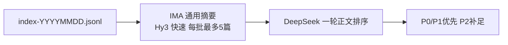

# investment-research-reports

从腾讯 ima 知识库同步并归档 PDF 研报。默认不做全量下载：先按 **AI Infrastructure** 主题排序，P0/P1 优先下载，普通额度有空余时用 P2 补到每日 30 篇。

这是一个 AI Workspace（上游数据源），不是传统应用程序。知识库访问与 PDF 下载通过 `ima-skill` + `scripts/sync-kb-pdfs.cjs` 完成，并保持 ima 中的原始目录结构和文件名。

## 给其他项目 / LLM：30 秒速览

| 问题 | 答案 |
| --- | --- |
| 这是什么？ | PDF 原文 + JSONL manifest 的上游归档仓 |
| 不是什么？ | 不做全文抽取、embedding、财务结构化，也不自行实现 IMA SDK |
| 默认下载谁？ | AI Infrastructure **P0/P1 优先，P2 补足**，每日普通额度 30 份 |
| 其他项目怎么读？ | 读 `manifests/` + `downloads/<local_relative_path>` |
| 字段与接入示例？ | 见 [docs/data-catalog.md](docs/data-catalog.md) |
| Agent 硬规则？ | 见 [AGENTS.md](AGENTS.md) |

## 核心产物

| 路径 | 用途 |
| --- | --- |
| `downloads/` | PDF 原文，保持原始目录与文件名 |
| `manifests/index.jsonl` | 知识库 PDF 全量索引（发现入口） |
| `manifests/index-YYYYMMDD.jsonl` | 指定单日目录的完整 PDF 快照 |
| `manifests/report-summaries-YYYYMMDD.jsonl` | 当天 IMA 通用摘要权威快照，角色为下载路由候选 |
| `manifests/ai-ranked-queue-summary-YYYYMMDD.jsonl` | 基于摘要正文的一轮 DeepSeek 主题排序 |
| `manifests/downloaded.jsonl` | 下载成功日志 |
| `manifests/failed.jsonl` | 下载失败日志 |
| `manifests/download-attempts.jsonl` | 上海日期口径的下载额度与第31篇探测审计日志 |
| `manifests/ai-ranking-analysis-YYYYMM.html` | 当月 P0–P3 排序看板；每日覆盖更新 |

HTML 仅供人工复核，不是机器读取的主数据源。跨机器引用 PDF 时用 `local_relative_path`，不要依赖 `saved_path`。

## 排序与过滤规则

主路径只服务 **AI Infrastructure** 主题。IMA 先逐篇生成行业无关通用摘要，DeepSeek 随后只做一次正文排序。IMA 摘要本身不判断 P0—P3，主题评级由 `rank-ai --summary-source` 完成。



### 一轮排序

模型默认 `deepseek-v4-pro`，可用 `DEEPSEEK_RANK_MODEL` 覆盖；为兼容旧环境，未设置时仍读取 `DEEPSEEK_RERANK_MODEL`。输入是标题、报告类型、通用摘要、关键结论、内容标签、关键数字、实体和原文证据。一次输出 P0–P3、score、理由与证据。

最终按 `priority`（P0→P3）→ `score` 降序 → 标题排序，并赋予从 1 开始的 `rank`。

### 优先级定义

| 级别 | 含义 | 典型主题 |
| --- | --- | --- |
| **P0** | 核心 AI Infrastructure | AIDC / hyperscaler 数据中心 capex、AI 服务器、GPU/ASIC、HBM/存储、先进封装/CoWoS、光互联、数据中心网络、电力/冷却/液冷、AI 半导体上游、人形机器人/具身智能核心硬件。明确 AIDC / AI 数据中心资本开支必须 P0 |
| **P1** | 强相关上游或投资线索 | 半导体设备/材料、晶圆厂扩产、ABF、PCB、MLCC、AI PC、明确指向 AI 基建/数据中心/云 capex 的 IT 支出、机器人或 AI 产能相关工业自动化 |
| **P2** | 泛 AI 或间接 | AI 应用、企业 AI 渗透率、互联网/云应用、生产率、科技硬件但基建指向不强 |
| **P3** | 弱相关或无关 | 宏观、地产、医疗、消费、银行、普通汽车销量、普通互联网估值等 |

**score 参考带**：P0 通常 85–100，P1 通常 65–84，P2 通常 35–64，P3 通常 0–34。

### 证据原则

- 区分「数据中心 / 地产 / 信托 / 估值 / 买卖评级」叙事与「技术资本开支」信号。
- 仅有前者、标题无 AI 基建技术证据 → 降权；同时出现 GPU、服务器、光模块、液冷、hyperscaler 扩建等证据 → 可保留较高优先级。

### 默认下载过滤

| 规则 | 默认值 |
| --- | --- |
| 下载优先级 | `--priorities P0,P1,P2`（P0/P1 优先，P2 补足，P3 不自动下载） |
| 每日预算 | `--daily-budget 30` |
| 上限探测 | `--quota-probe-extra 1`（第 31 篇只试一次，绝不继续第 32 篇） |
| 全量下载 | 仅当用户明确要求时才做 |
| `download-queue` | 未经用户明确要求，不要运行 |
| IMA 额度触顶 | 「资料获取次数已达上限」等错误必须立即停止 |

## 其他项目怎么读

1. **发现有哪些 PDF** → 读 `manifests/index.jsonl`
2. **只要 AI Infra 高优** → 读当天 `manifests/ai-ranked-queue-summary-YYYYMMDD.jsonl`，过滤 `priority === 'P0' || priority === 'P1'`，按 `rank` 排序
3. **读本地 PDF** → `path.join(repoRoot, 'downloads', record.local_relative_path)`

字段含义、完整示例与约束见 [docs/data-catalog.md](docs/data-catalog.md)。

## 每日流程

DeepSeek 配置从 `.env` 读取（不提交）：

```bash
DEEPSEEK_API_KEY=...
DEEPSEEK_RANK_MODEL=deepseek-v4-pro
DEEPSEEK_BASE_URL=https://api.deepseek.com
```

### 1. 索引目标月份

```bash
node scripts/sync-kb-pdfs.cjs index \
  --kb "环球研报直通车" \
  --source-path "2026年国际顶级投行研报/7月" \
  --strip-source-prefix "2026年国际顶级投行研报" \
  --local-prefix "2026"
```

可按需对多个月份各跑一次。索引写入 `manifests/index.jsonl`。

单日索引可同时另存完整快照，供 rank-ai 对账和人工金标准复核：

```bash
node scripts/sync-kb-pdfs.cjs index \
  --kb "环球研报直通车" \
  --source-path "2026年国际顶级投行研报/7月/7.14" \
  --strip-source-prefix "2026年国际顶级投行研报" \
  --local-prefix "2026" \
  --snapshot manifests/index-20260714.jsonl
```

### 每日 IMA 正文摘要与可恢复排序

仓库已将“当天目录、Hy3 快速、Browser 优先且 App 兜底、每批最多 5 篇、每批新建独立对话、提取完整 JSON、逐篇写进度、断点续跑、正文排序”固化为日期参数化任务：

```bash
node scripts/ima-daily-summary.cjs prepare
node scripts/ima-daily-summary.cjs next --surface browser
# Browser 直接提取完整回答后传给 ingest；仅在 Browser 失败时改用：
node scripts/ima-daily-summary.cjs next --surface app
pbpaste | node scripts/ima-daily-summary.cjs ingest --surface app
node scripts/ima-daily-summary.cjs finalize
node scripts/ima-daily-summary.cjs status
```

Prompt 使用 `prompts/ima-download-screen-summary-batch-v2.txt`，每日状态全部保存在 `manifests/`。完整的 Browser 优先、IMA App 兜底、失败停止、下载与 Git 开关见 [docs/ima-daily-summary-runbook.md](docs/ima-daily-summary-runbook.md)。

### 2. 一轮生成摘要正文 queue（不耗 IMA 下载额度）

```bash
node scripts/sync-kb-pdfs.cjs rank-ai \
  --summary-source manifests/report-summaries-YYYYMMDD.jsonl \
  --queue manifests/ai-ranked-queue-summary-YYYYMMDD.jsonl
```

### 3. 更新当月 P0–P3 看板（不调 DeepSeek / IMA）

```bash
node scripts/render-ai-ranking-html.cjs \
  --month YYYYMM \
  --out manifests/ai-ranking-analysis-YYYYMM.html
```

渲染器会自动汇总当月所有日期化 summary queue，按 `media_id` 去重，并展示 P0、P1、P2、P3 和 `UNREVIEWED`。HTML 每月只保留一份。

### 4. 按 queue 下载（耗 IMA 额度）

```bash
node scripts/sync-kb-pdfs.cjs download-queue \
  --kb "环球研报直通车" \
  --queue manifests/ai-ranked-queue-summary-YYYYMMDD.jsonl \
  --priorities P0,P1,P2 \
  --daily-budget 30 \
  --quota-probe-extra 1
```

每个文件下载前会重新调用 `get_media_info`，用返回的临时 URL 与 headers 拉取 PDF。成功立即写 `downloaded.jsonl`，失败写 `failed.jsonl`。已存在的文件跳过。

关注输出中的 `by_priority`、`downloaded`、`budget_used`、`stopped_quota`。

### 提交

- 当天正式结果：提交 `report-summaries-YYYYMMDD.jsonl`、`ai-ranked-queue-summary-YYYYMMDD.jsonl`，并更新提交 `ai-ranking-analysis-YYYYMM.html`
- PDF 是否提交需单独确认，避免无意提交大量文件

## 仅明确要求全量时

```bash
node scripts/sync-kb-pdfs.cjs sync \
  --kb "环球研报直通车" \
  --source-path "2026年国际顶级投行研报/7月" \
  --strip-source-prefix "2026年国际顶级投行研报" \
  --local-prefix "2026"
```

默认路径不要用全量 `sync` / `download`。

## 仓库入口

| 路径 | 说明 |
| --- | --- |
| [AGENTS.md](AGENTS.md) | Agent 唯一配置与硬规则 |
| `CLAUDE.md` | 指向 `AGENTS.md` 的 symlink |
| `ima-skill/` | ima OpenAPI Skill；`.claude/skills/ima-skill` 为其 symlink |
| `scripts/sync-kb-pdfs.cjs` | 索引、排序、按 queue 下载 |
| `scripts/render-ai-ranking-html.cjs` | 月度 P0–P3 HTML 看板 |
| [docs/data-catalog.md](docs/data-catalog.md) | 字段、路径约定、跨项目引用 |

同步与下载的完整约束（断点恢复、`media_id`、`get_media_info`、禁止自行批量 curl 等）见 [AGENTS.md](AGENTS.md)。
